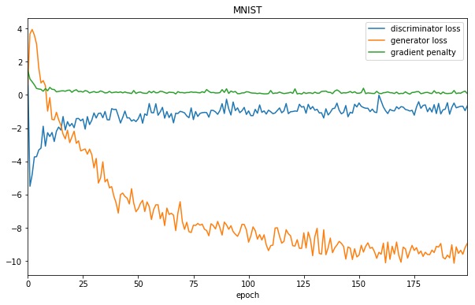
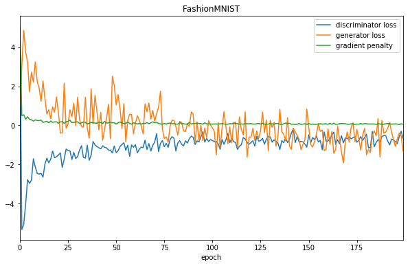
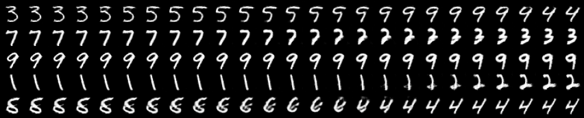
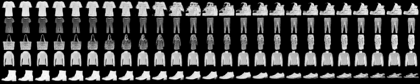

## Pytorch WGAN-GP

This is a pytorch implementation of [Improved Training of Wasserstein GANs](https://arxiv.org/abs/1704.00028). Most of the code was inspired by [this repository](https://github.com/EmilienDupont/wgan-gp) by [EmilienDupont](https://github.com/EmilienDupont).

## Training

To train on the MNIST dataset, run
```
python main.py --dataset mnist --epochs 200
```
For the FashionMNIST dataset, run
```
python main.py --dataset fashion --epochs 200
```
You cans also set up a generator and discriminator pair and use the `WGANGP` class:
```python
wgan = WGANGP(generator, discriminator,
              g_optimizer, d_optimizer,
              latent_shape, dataset_name)
wgan.train(data_loader, n_epochs)
```

The argument `latent_shape` is the shape whatever the generator's forward function accepts as input.

The training process is monitored by [tensorboardX](https://github.com/lanpa/tensorboardX).

## Results

Here is the training history for both datasets:




Two gifs of the training process:


## Interpolation in latent space

We can generate samples going smoothly from one class to another by interpolating points on the latent space (done in [this notebook](interpolation.ipynb)):




The weights of the models are on the saved_models folder.
